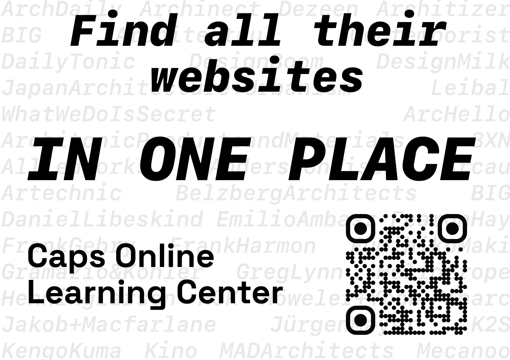
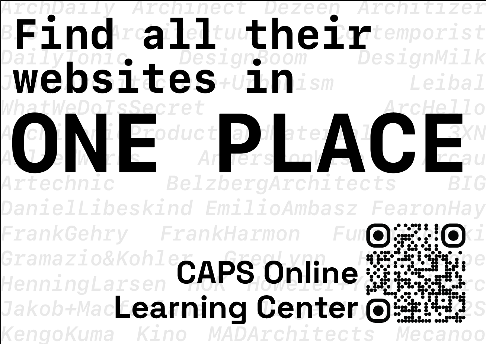

# The Art of Visual Storytelling
<Tags :tags="$frontmatter.tags" :wc="$frontmatter.wc" />
  
*I recently attended a poster design workshop at Bangalore International Centre called The Art of Visual Storytelling, conducted as part of the Maps Of Memory exhibition, and here's what I learnt!*

I'm not new to the world of graphic design- or design in general; I've always been interested in design and have been more of an appreciator of good design rather than the creator, but I figured, with promotions for my project coming up, it would be a great refresher. 

I decided to attend this workshop primarily because I've always been impressed by the graphic work BIC puts out. I'm subscribed to their Instagram page, and every event poster they put out is well-put-together and really thoughtfully designed. So, why not learn from the best?

## The Basics

### Visual Hierarchy
>The order in which we perceive information from any medium, including posters. Some of the factors that influence this are 

- Size
- Colour Contrast
- Negative space
- Position

This is put across really well as a visual hierarchy table. 

This information is a design perspective built upon the underlying [Gestalt Principles](https://www.interaction-design.org/literature/topics/gestalt-principles) that describe how humans group similar elements, recognise patterns and simplify complex images when we perceive objects. 

### Symmetry

Symmetry contributes to maintaining visual heirarchy. Having multiple elements on the same row after center-aligned text will lead to a breakdown in visual hierarchy and confusion. 

This initial draft of a poster for my project's poster is a good example. Visual hierarchy is maintained for the first two lines. Following that, Due to the Caps Online Learning Center text being Left aligned and having the same precedence as the QR code, It breaks down the visual hierarchy and leaves the audience a little confused. 

Maintaining Symmetry (Top Left vs Bottom Right), Emphasizing the main message and aligning the text to compliment the QR code lends some much-needed relief to the poster. 

 Separating/Grouping elements into distinct blocks of information or creating negative space between groups of elements lends relief and re-establishes visual hierarchy. 

## The Main Takeaways 

The facilitator, Mrs Diya Deviah, then touched upon some very helpful topics you aren't really exposed to while learning about design: What happens after you design something? 

### Call to Action

> A call to action is what eventually guides your audience to the next steps they have to take after looking at your poster. 

Call to action can be of various types, e.g. a Link to purchase tickets on a promotional poster or a link to a WhatsApp group / Instagram page / E-Mail List for an Awareness poster. 
This Call to Action must be clear, distinct and direct as you're trying to guide them to a desired outcome. 

### Control

You have control over a poster upto the point where it's distributed. Once your poster is distributed in print or online, you can consider it to be out of your control.

QR Codes are now the most popular form of Call To Action as you can easily lead them to a place where they can be more involved. While making a QR Code, make sure that the link it leads to is *dynamic*

Once it's out of your control, **you can no longer change the QR Code(link)** itself. If the link to your Google form for registrations changes, you won't be able to update your poster, and it will immediately reach its end of life. 

### Digital Posters

Digital formats are usually easier to manage as you generally have fewer things to worry about, but you must still consider the ease of Action.

**Ease of Action** - This is about how easy it is for people to perform/go through with the call to action on your design. 
	- If it's a QR code on an image that's circulated digitally, people will have to take more steps to get to the link, as they have to screenshot it and then scan it from their gallery to get to the link. 
	- Make sure that, wherever possible, embedded links are attached to the QR code on PDFs so that clicking on it will open the link.

### Physical Posters - Distribution & Circulation

For physical posters, there are a couple of extra steps between designing your poster and the poster reaching your audience that you have to be mindful of. 

- **How it's being printed?** - This is an extremely underrated concern when designing a poster. You need to keep in mind that the colours of your design will vary a lot between your DCI-P3 colour-calibrated display and the barely maintained printers that your posters are coming out of. The beautiful green you designed might look watered down in the final print. 
- **Where it's going?** - You have to scout out or, at least, be mindful of where your posters will be put up. Generally, there's going to be a lot of competition for people's attention on notice boards or public billboards, and your poster has to stand out. This is generally achieved by contrasting your design with the general trend of other posters.
- **Who is putting it up?** - When outsourcing distribution work, the person putting the posters up might not have the same priorities as you. Based on your design, ensure that the person putting the posters up thinks before they do so. (I'm not encouraging micromanagement, but I've had to adopt a no-delegation rule for a reason 😔)

### Design Language

>When designing a whole, you need to make sure that all its parts follow the same design language to maintain visual hierarchy. 

For example, you have a blog that automatically displays the latest written article on the front page. If your blog's landing page is minimal and the image you use for the article's cover is bright and playful, It breaks the visual hierarchy and leads people to look at the image first. 
Always maintain consistency in colour and design on all the pages that you're working on. 

### Brief Visual Impact

You're designing your poster to grab your audience's attention and maintain visual hierarchy throughout. But, in the real world, it's more likely for people to not follow through reading your poster all the way from the top to the bottom. You must design with the understanding that engagement is temporary and people are more likely to read only half or a quarter of the information on the poster. The goal is to make sure that this 50% or 25% of the poster they read is enough to convey the purpose or idea that you're trying to get across with your poster.
 

  

*I've seen some very good but poorly executed designs, and I hope this post will inspire you to think about design as an end-to-end process from source to audience and not as a fragmented process.*

